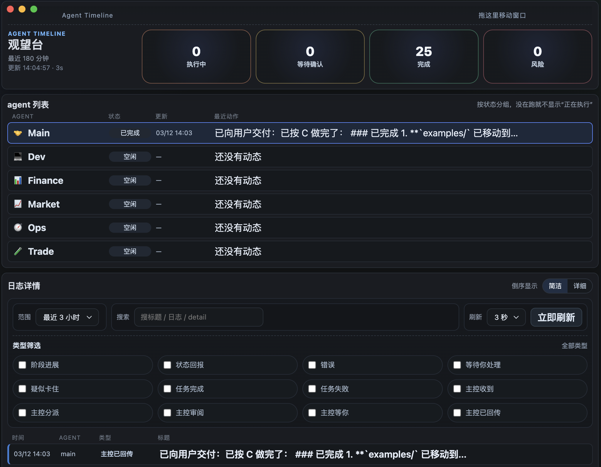
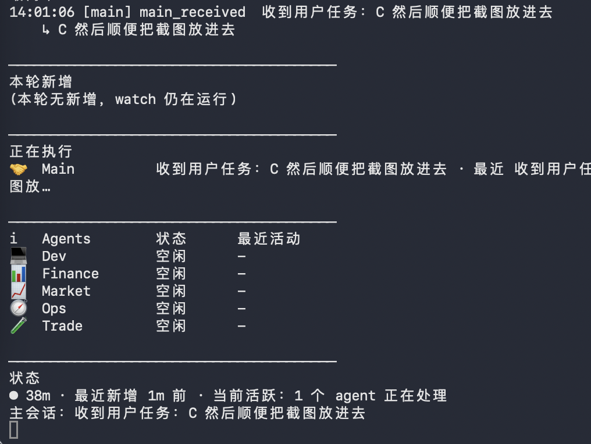

# OpenClaw Agents Watch

一个给 **OpenClaw / 本地多 agents 使用者** 的观察工具原型。  
A prototype watch tool for **OpenClaw / local multi-agent users**.

它的目标很直接：  
Its goal is simple:

> 当多个 agents 在本地运行时，你不需要再盯着静默终端等结果。  
> 你可以直接看到谁在执行、谁在等待确认、谁疑似卡住、谁已经完成。  
>
> When multiple agents are running locally, you no longer need to stare at a silent terminal and wait.  
> You can directly see who is running, who is waiting for confirmation, who looks stuck, and who has finished.

当前项目提供两种查看方式：  
This project currently provides two ways to observe your runtime:

1. **CLI 模式**：适合终端快速查看、持续 watch、低打扰盯盘  
   **CLI mode**: great for terminal-based quick checks, continuous watch, and low-noise monitoring
2. **GUI 模式**：适合桌面观察、筛选日志、查看 agents 当前状态  
   **GUI mode**: great for desktop observation, log filtering, and checking current agent status

## Screenshots

<p>
  
  
</p>

## 适合谁 / Who it's for

这个项目适合：  
This project is for people who:

- 已经在本地部署 OpenClaw  
  already run OpenClaw locally
- 已经跑起来多个 agents  
  already have multiple agents running
- 想要一个比“静默终端”更直观的观察工具  
  want something more visible than a silent terminal
- 想快速知道当前是“正在运行 / 等待确认 / 异常结束 / 风险状态”  
  want to quickly know whether the system is running, waiting for confirmation, ending abnormally, or in a risky state

它**不适合**：  
It is **not** for:

- 还没有安装 OpenClaw 的普通终端用户  
  people who have not installed OpenClaw yet
- 期待双击安装即可独立运行的通用桌面软件用户  
  people expecting a fully standalone desktop app with one-click install

## 当前能力 / Current capabilities

### CLI

CLI 直接读取本机 OpenClaw 配置与会话数据，提供：  
The CLI reads your local OpenClaw configuration and session data, and provides:

- `overview`：agents 概览（谁在跑、谁完成、谁失败、谁疑似卡住）  
  `overview`: agent overview (who is running, completed, failed, or looks stuck)
- `stream`：最近时间线（按真实会话消息回放）  
  `stream`: recent timeline (replayed from real session messages)
- `summary`：工作纪要（更像晨报，不是机械计数）  
  `summary`: work summary (more like a briefing than raw counters)
- `watch`：持续刷新观察台  
  `watch`: continuously refreshing watch view

### GUI

GUI 当前是单列桌面观察台：  
The GUI is currently a single-column desktop watchboard:

- 顶部总览（执行中 / 等待确认 / 完成 / 风险）  
  top summary (running / waiting / completed / risk)
- agents 列表  
  agents list
- 日志详情（简洁 / 详细）  
  log details (compact / detailed)
- 范围 / 搜索 / 刷新工具栏  
  range / search / refresh toolbar
- 类型筛选  
  type filters

## 运行 / Run

### CLI

```bash
# 概览 / overview
node bin/agent-timeline.mjs overview

# 时间线流 / stream
node bin/agent-timeline.mjs stream --minutes 180 --limit 40

# 工作纪要 / summary
node bin/agent-timeline.mjs summary --minutes 1440

# 持续刷新（更适合盯多 agents） / watch multiple agents
node bin/agent-timeline.mjs watch --minutes 180 --limit 20 --interval-sec 5
```

### GUI

```bash
npm install

# 本地开发（Vite + Electron） / local dev
npm run gui:dev

# 构建校验 / build check
npm run gui:build

# 启动生产模式 GUI / start production GUI
npm run gui:start
```

## 数据来源 / Data sources

当前项目依赖本机已有的 OpenClaw 数据目录，主要读取：  
This project depends on your local OpenClaw data directory and mainly reads:

- `~/.openclaw/openclaw.json`
- `~/.openclaw/agents/main/sessions/sessions.json`
- `~/.openclaw/subagents/runs.json`
- `~/.openclaw/agents/main/sessions/*.jsonl`

> 这意味着它目前是一个 **依赖 OpenClaw 本地数据的观察工具**，不是脱离 OpenClaw 就能独立运行的通用应用。  
> This means it is currently a **watch tool built on top of local OpenClaw data**, not a standalone generic desktop app.

## 当前设计重点 / Current design focus

- 用“观察台”而不是“任务后台”的方式呈现多 agent 状态  
  Present multi-agent runtime as a watchboard, not a task admin panel
- 优先让用户知道：  
  Prioritize answering:
  - 谁在执行 / who is running
  - 谁在等你回复 / who is waiting for your reply
  - 谁疑似空跑 / 异常结束 / who looks like an empty run or abnormal exit
  - 谁已经完成 / who has finished
- 终端和 GUI 两套入口都可用  
  Both terminal and GUI entry points are available
- 对“run 表面成功、实际没干活”的场景补了二次识别  
  Adds secondary detection for runs that look successful on the surface but did not actually do useful work

## 当前限制 / Current limitations

- 仍然依赖 OpenClaw 本地目录结构  
  Still depends on the local OpenClaw directory structure
- 还没有做正式安装包（如 macOS dmg / Windows exe）  
  No formal install package yet (such as macOS dmg / Windows exe)
- 目前更适合作为 **公开原型 / 本地观察工具**，而不是通用商业桌面产品  
  Better suited today as a **public prototype / local watch tool** than as a general commercial desktop product

## 为什么做它 / Why this exists

对于本地多 agent 使用者来说，最大的体验问题之一不是“不能跑”，而是：  
For local multi-agent users, one of the biggest problems is not that agents cannot run, but that:

- 终端很安静 / the terminal is quiet
- 不知道当前到底有没有在执行 / you cannot tell whether something is still running
- 不知道是在等确认、卡住了，还是其实已经出错 / you cannot tell whether it is waiting, stuck, or already failed

这个项目就是为了解决这个问题：  
This project exists to solve exactly that:

> 给本地多 agent 环境一个能看、能扫读、能快速判断状态的观察界面。  
> Give local multi-agent environments a visible, scannable interface for quickly understanding current status.

## 更多示例 / More examples

- `docs/examples/overview.txt`
- `docs/examples/stream.txt`
- `docs/examples/summary.txt`
- `docs/examples/watch.txt`
